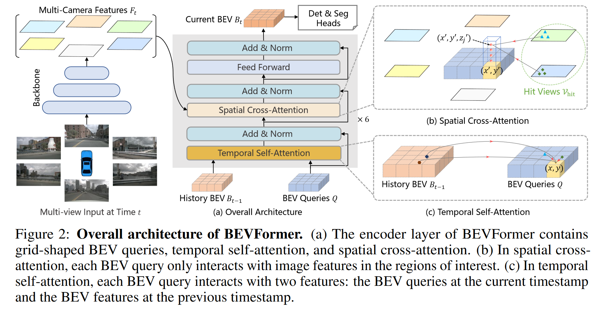

# BEVFormer

BEVFormer is a structure which exploits both spatial and temporal information by interating with spatial and temporal space through predefined grid-shaped BEV queries to generate Bird-Eyes Views from multi-camera image features. It can provide a unified surrounding environment representation for various autonomous driving perception tasks. 

## Background

A complete camera solutions own the desirable advantages to detect long-range distance objects, identify vision-based road elements (e.g., traffic lights, stoplines), compared to LiDAR-based counterparts and also cheaper. The reason that BEV now shows relatively bad performance is that 3D object detection task requires strong BEV features to support accurate 3D bounding box prediction, but generating BEV from the 2D planes is ill-posed. The accuracy of depth information is crucial. BEVFormer aims to *design a BEV generating method that does not rely on depth information and can learn BEV features adaptively rather than strictly rely on 3D prior*.

## Structure 

### Overall Architecture

There are six layers in one encoder. Three special designs:
 
1. Grid-shaped BEV queries: Query features in BEV space from multi-camera views
2. Spatial cross-attention module: Lookup and aggregate spatial features from multi-camera images
3. Temporal self-attention module: Lookup and aggregate temporal features from history BEV

### BEV Queries

A group of grid-shaped learnable parameters $Q\in \mathbb{R}^{H\times W\times C}$ where $H$ and $W$ are the heights and the weights of the BEV plane. Each position $p = (x, y)$ bears a query of $Q_p \in \mathbb{R}^{1\times C}$. Add positional embedding to BEV queries $Q$.

### Spatial Cross-Attention

Based on deformbale attention.

