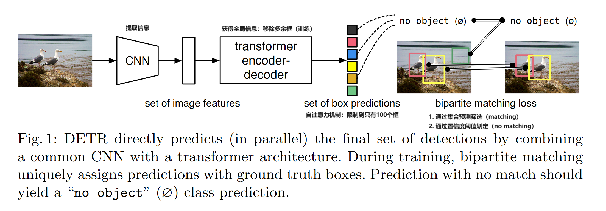
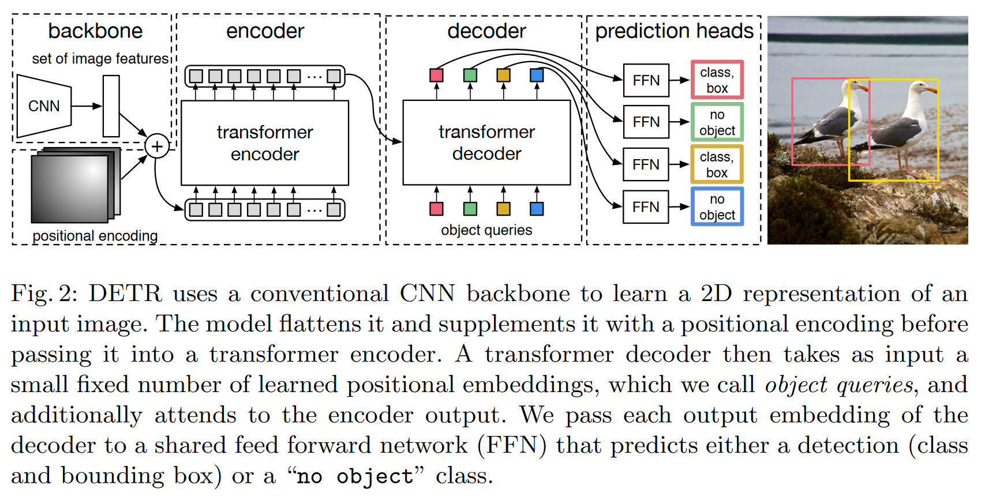

# End-to-End Object Detection with Transformers

DeTR stands for DEtection TRansformer is a set-based global loss that forces unique predictions via **bipartite matching** and a **transformer encoder-decoder architecture**. 

## Background

The goal of object detection is to:
- predict a set of bounding boxes 
- categorize labels for each object of **interest** 

The methods used are:
- **Proposals:** Generate sets of possible regions, then by using techniques like NMS to locate on one most probable region. 
- **Anchors:** Used as reference point to predict the positional adjustments for each anchor relative to the true location.
- **Window centers:** Non-anchor based methods.

The methods used before are strongly restricted by the postprocessing steps. This essay proposed an **end-to-end** direct prediction method. 

## Structure

The matching part is realized through bipartite matching algorithms. The new model requires extra-long training schedule and benefits from auxiliary decoding losses in the transformer. 

### Object detection set prediction loss

To find a bipartite matching between these two sets we search for a permutation of $N$ elements $\sigma \in S_N$ with the lowest cost:

$$
\hat{\sigma} = \arg\min_{\sigma \in \mathcal{S}_N} \sum_{i} \mathcal{L}_{\text{match}}(y_i, \hat{y}_{\sigma(i)})
$$

where $\mathcal{L}_{\text{match}}(y_i, \hat{y}_{\sigma(i)})$ is a pair-wise matching cost between ground truth $y_i$ and a prediction with index $\sigma(i)$. This optimal assignment is computed efficiently with the Hungarian algorithm. The definition of the matching cost in the essay is $- \mathbb{1}_{\{c_i \neq \varnothing\}} p_{\sigma(i)}(c_i) + \mathbb{1}_{\{c_i \neq \varnothing\}} \mathcal{L}_{\text{box}}(b_i, \hat{b}_{\sigma(i)})$.

Then we compute the Hungarian loss, which is like:

$$
\mathcal{L}_{\text{Hungarian}}(y, \hat{y})=\sum_{i=1}^N [-\log p_{\sigma(i)}(c_i) + \mathbb{1}_{\{c_i \neq \varnothing\}} \mathcal{L}_{\text{box}}(b_i, \hat{b}_{\sigma(i)})]
$$

While such approach simplify the implementation it poses an issue with relative scaling of the loss. To mitigate this issue a linear combination of the $l_1$ loss and the generalized $\text{IoU}$ loss.

### Backbone

A conventional CNN backbone with $C=2048, H=\frac{H_0}{32}, W=\frac{W_0}{32}$.

### Transformer Encoder

1. $1\times 1$ convolution: From dimension $C$ to $d$.
2. Collapse the spatial dimensions of $z_0$ into one dimension, resulting in a $d\times HW$ feature map.
3. Each encoder layer has a **standard architecture** and consists of a **multi-head self-attention module** and a **feed forward network** (FFN).
4. Supplement it with **fixed positional encodings**. 

### Transformer Decoder

The decoder follows the standard architecture of the transformer, transforming $N$ embeddings of size $d$ using multi-headed self- and encoder-decoder attention mechanisms.

The difference is DETR decodes the $N$ objects in parallel at each decoder layer.

## Extensions

DETR is straightforward to implement and has a flexible architecture that is easily extensible to **panoptic segmentation**, with competitive results. In addition, it achieves significantly better performance **on large objects** than Faster R-CNN, likely thanks to the processing of global information performed by the self-attention.

## Reference
1. Carion, N., Massa, F., Synnaeve, G., Usunier, N., Kirillov, A., & Zagoruyko, S. (2020). End-to-End Object Detection with Transformers (arXiv:2005.12872). arXiv. http://arxiv.org/abs/2005.12872
1. [DETR 论文精读【论文精读】](https://www.bilibili.com/video/BV1GB4y1X72R/?spm_id_from=333.337.search-card.all.click)
