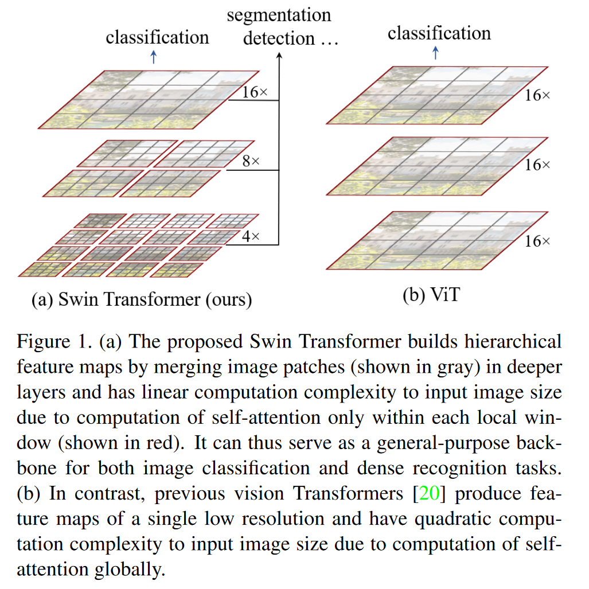
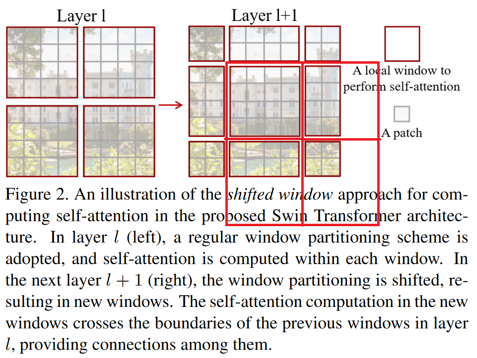
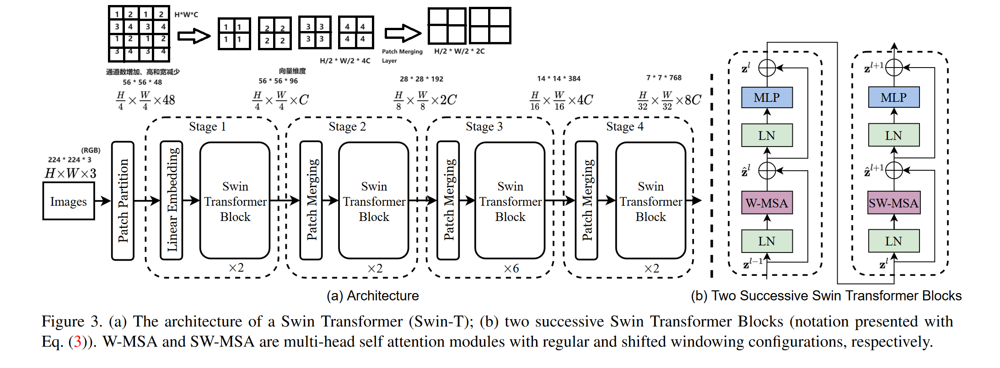
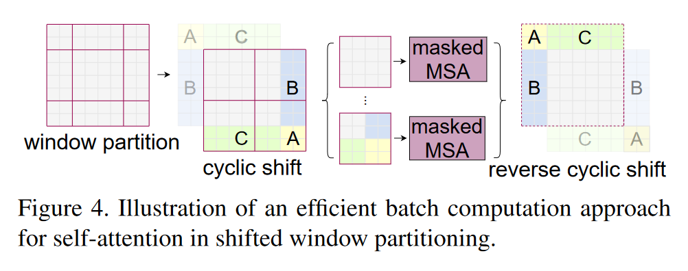
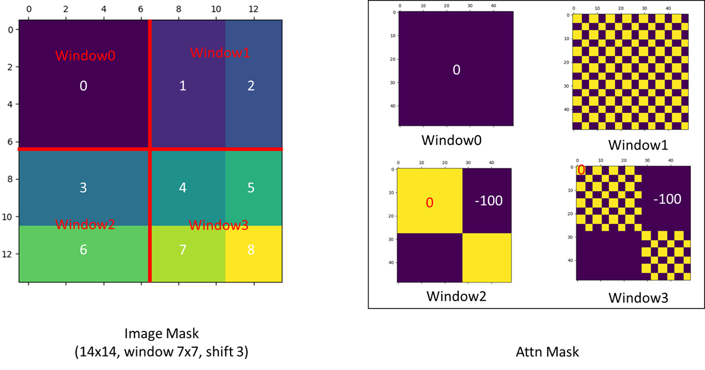

# SWin Transformer

SWin Transformer stands for Shifted Windows Transformer. This marks the first application of Transformer in the view of computer vision.

## Background

After the publication of Transformer, it is anticipated that the Transformer sturcture can be widely applied in many fields. However, **large variations in the scale of visual entities** and **the high resolution of pixels in images** are the two major challenges the field is facing.

## Features

The two features of the SWin Transformer are:
- Hierarchical Structure
    - Leverage advanced techniques for dense prediction such as feature pyramid networks (FPN) or U-Net.
    - Flexibility to model at various scale.
    - Has linear computational complexity with respect to image size.

- Shifted Windows
    - Bring greater efficiency by limitting self-attention computation to non-overlapping local windows while also allowing for cross-window connection.

## Structure

The whole structure of SWin Transformer is based on the Encoder-Decoder Transformer structure. Each of the Swin Transformer is composed of two multi-head self attention components (introduced in [Transformer](./Transformer.md)). And the input for each is the original windows and the shifted windows. 

The computation of the window partition is shown as follows. 

The mask mechanism of the above process is shown as follows.

## Reference 
1. Ze Liu, Yutong Lin, Yue Cao, Han Hu, Yixuan Wei, Zheng Zhang, Stephen Lin, and Baining Guo. Swin Transformer: Hierarchical Vision Transformer using Shifted Windows, August 2021. arXiv:2103.14030
2. [Swin Transformer论文精读【论文精读】](https://www.bilibili.com/video/BV13L4y1475U/?spm_id_from=333.788&vd_source=87bb079e03d49083a7a4a54e76612043)
3. [Issue: The Question about the mask of window attention](https://github.com/microsoft/Swin-Transformer/issues/38)