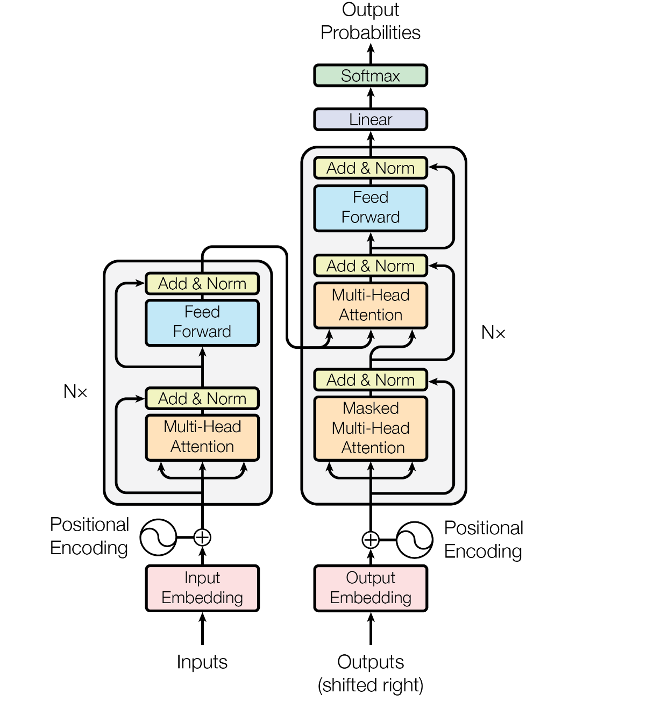
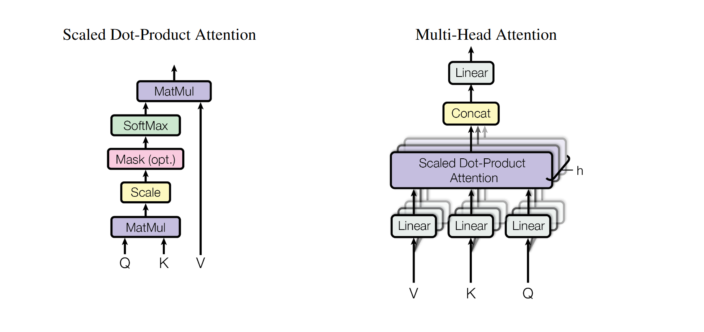

# Transformer

Transformer was first appeared as a progress made in machine translation, but soon spread out to other subjects because of its high quality output and better performance.

## Background 

Before Transformer, the dominant sequence transaction models are based on complex recurrent or convolutional neural networks (CNN) after the work of AlexNet and ResNet. There are some shortcomings with these models: 

- Inherent sequential nature precludes parallelization.
- Memory constraints limit batching.

## Highlights

Compared with other networks, Transformer mainly focus on Attention. It has following features that are very intriguing.

- It abandons the usage of RNNs or CNNs and uses solely attention mechanism while preserving the encoder-decoder structure.
- The main reason of the reduction of time complexity is that the whole algorithm is completely based on Matrix-Matrix Multiplication and Matrix-Vector Multiplication, which are highly parallelizable in computers. 
- Multi-head self-attention mechanism helps Transformer to have several tunnels to preserve the semantic meanings of the sentence.
- Residual Connection and Layer Normalization are used to boost the performance and also reduce errors. 
- The attention mechanism used is Scaled dot-product (multiplicative) attention with a factor $\frac{1}{\sqrt{d_k}}$ compared with normal dot-product attention. 
- To preserve the sequential information, it has used Mask in Scaled dot-product (multiplicative) attention after using position encoding.
- Position-wise feed-forward networks between each two of the layers.

## Structure

The left side of figure is the Encoder, which is composed of a stack of $N=6$ identical layers. Each layer has two sub-layers: Multi-head self-attention mechanism and position-wise fully connected feed-forward network. 

The right side of figure is the Decoder, which is composed of a stack of $N=6$ identical layers. Each layer has three sub-layers. The decoder inserts a third sub-layer, which performs multi-head attention over the output of the encoder stack. 

A residual connection around each of the sub-layers are employed, followed by layer normalization. 

## Some Key Points

### Query
The Query vector represents the current element. It is used to score how relevant other elements in the sequence are to this current element.

### Key
The Key vector represents other elements in the sequence that the current element (as represented by the Query) might attend to. 

### Value
The Value vector contains the actual information from the sequence that needs to be encoded into the output.

### Self-attention
The self-attention mechanism works by computing a representation of an input sequence by considering how each element of the sequence interacts with every other element.The mechanism computes the dot product of the Query vector of each element with the Key vector of every other element to produce a score, indicating how much focus to put on other parts of the input sequence when encoding the current element.

## Reference

1. Ashish Vaswani, Noam Shazeer, Niki Parmar, Jakob Uszkoreit, Llion Jones, Aidan N. Gomez, Lukasz Kaiser, and Illia Polosukhin. Attention Is All You Need, August 2023. arXiv:1706.03762 [cs].
1. [Transformer论文逐段精读【论文精读】](https://www.bilibili.com/video/BV1pu411o7BE/?spm_id_from=333.788&vd_source=87bb079e03d49083a7a4a54e76612043)
