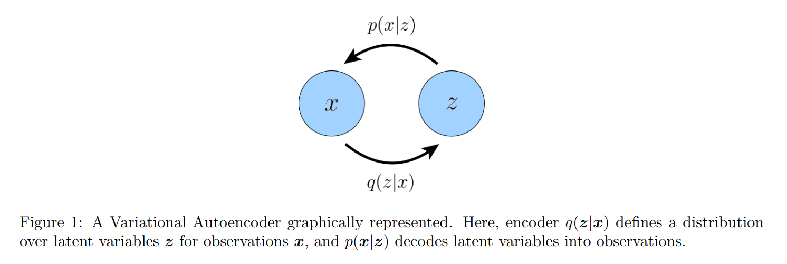
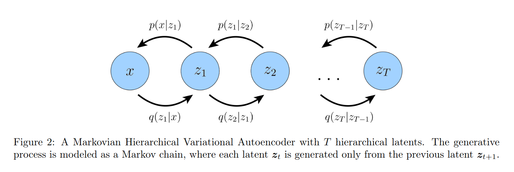
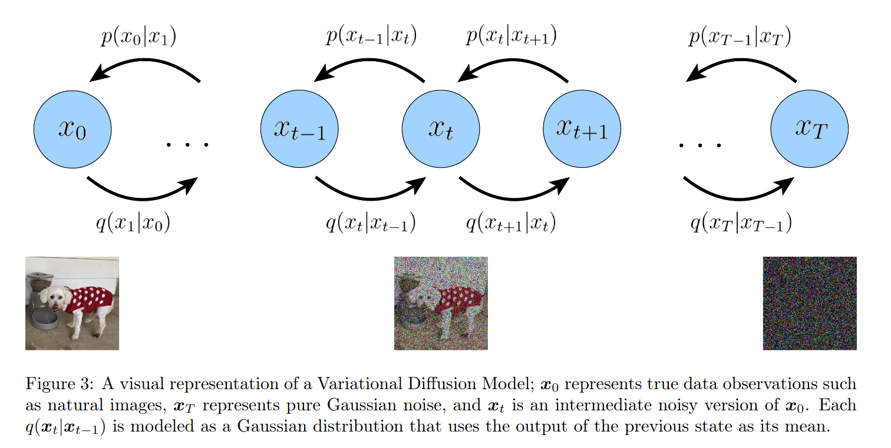
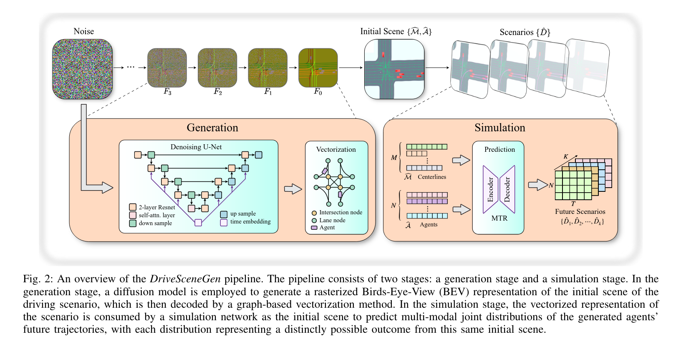
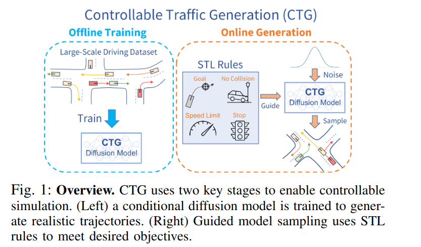
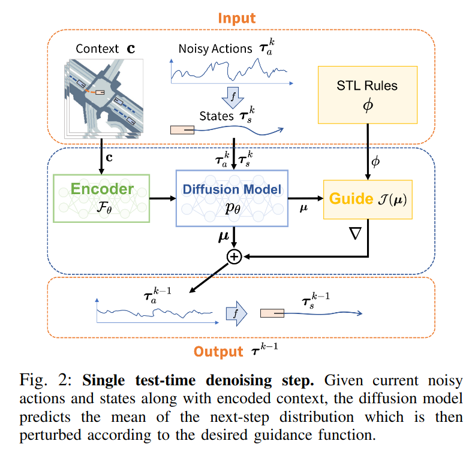
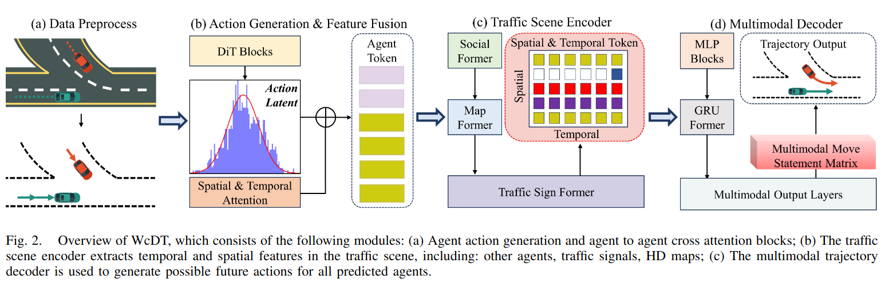
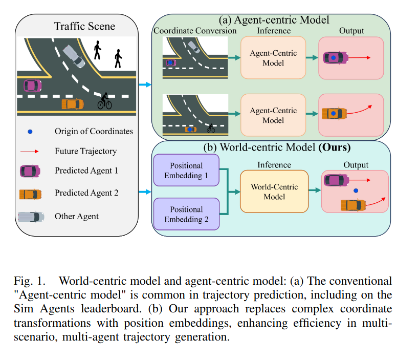
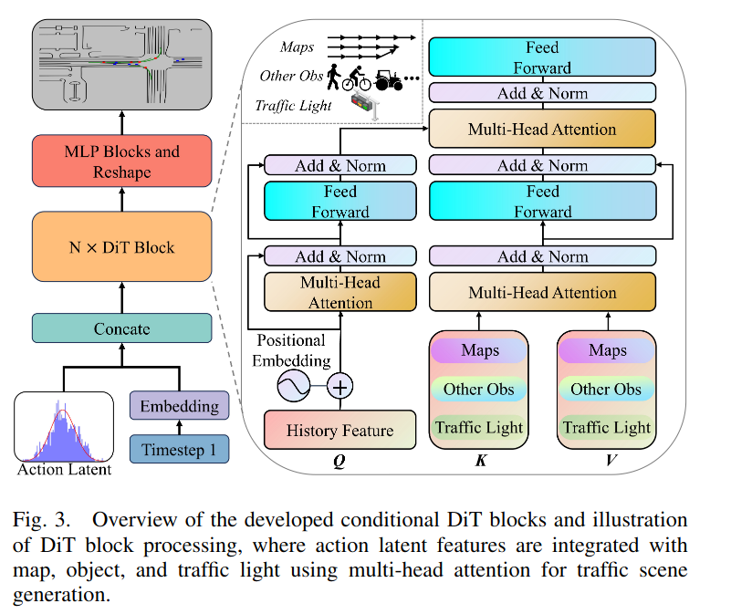

# Diffusion Model for Scenario Generation

## Background

### ELBO
对于生成模型来说，我们所观察到的数据本质上可以理解为由某个隐变量 $z$ (Latent Variable)所表征出来的现象. 我们观察到的数据本质上是 $x$ 和 $z$ 的联合分布，并不能直接用我们所观察到数据的概率分布来预测下一个分布. 有两种方式可以找到我们数据的概率分布

1. 通过积分求解边缘分布
    $$
    p(x) = \int p(x, z) d z
    $$
2. 通过贝叶斯求解
    $$
    p(x) = \frac{p(x, z)}{p(z | x)}
    $$

这两种方式都有其缺陷的地方：前者的积分对于复杂模型无法求解，后者要求我们知道一个概率生成的Ground Truth $p(z | x)$. 

ELBO 是一个置信度下界，可以通过这两个公式求得. 寻找ELBO的最大值，就是成为我们优化一个隐变量模型的目标.

$$
\log p(x) = \log \int p(x, z) d z = \log \int \frac{q_{\phi}(z | x)}{q_{\phi}(z | x)} p(x, z) d z = \log \mathbb{E}_{q_{\phi}(z | x)} \left[ \frac{p(x, z)}{q_{\phi}(z | x)} \right] \geq \mathbb{E}_{q_{\phi}(z|x)} \left[ \log \frac{p(x, z)}{q_{\phi}(z|x)} \right] = \text{ELBO}
$$

其中$q_{\phi}(z | x)$ 是一个拥有参数$\phi$ 近似的后验分布. 通过另外一种形式的推导，我们可以理解ELBO的下界取得的条件是近似后验分布和真实后验分布的KL散度最小. 而KL散度是一个非负的值，所以ELBO是一个下界.

$$
\begin{aligned}
\log p(x) &= \log p(x) \int q_{\phi}(z |x) dz \\ 
&= \int q_{\phi}(z | x) \log p(x) dz \\
&= \int q_{\phi}(z | x) \log \frac{p(x, z)}{p(z | x)} dz \\
&= \int q_{\phi}(z | x) \log \frac{p(x, z)}{q_{\phi}(z | x)} dz + \int q_{\phi}(z | x) \log \frac{q_{\phi}(z | x)}{p(z | x)} dz \\
&= \text{ELBO} + KL(q_{\phi}(z | x) || p(z | x))
\end{aligned}
$$

### Variational Autoencoder

Variational Autoencoder 是一个生成模型，通过最大化ELBO来训练模型. 通过一个编码器网络 $q_{\phi}(z | x)$ 将输入数据 $x$ 映射到一个潜在空间 $z$ 中. 通过一个解码器网络 $p_{\theta}(x | z)$ 将潜在空间 $z$ 映射到数据空间 $x$ 中.

$$
\begin{aligned}
\text{ELBO} &= \mathbb{E}_{q_{\phi}(z | x)} \left[ \log \frac{p(x, z)}{q_{\phi}(z | x)} \right] \\
&= \mathbb{E}_{q_{\phi}(z | x)} \left[ \log p(x | z) \right] - KL(q_{\phi}(z | x) || p(z))
\end{aligned}
$$

这个式子的第一项是重构误差，第二项是KL散度. 通过最大化ELBO，我们可以训练一个生成模型，通过输入数据 $x$ 来生成一个潜在空间 $z$ 的分布，然后通过解码器网络来生成数据 $x$. $p(z)$ 是一个先验分布，通常我们会选择一个简单的分布，比如高斯分布.

$$
\begin{aligned}
q_{\phi}(z | x) &= \mathcal{N}(\mu_{\phi}(x), \sigma_{\phi}^2(x)I) \\
p(z) &= \mathcal{N}(0, I)
\end{aligned}
$$

TODO：补充这里的数学推导

### Hierarchical Variational Autoencoder

Hierarchical Variational Autoencoder 是一个多层次的生成模型，其建立在马尔科夫链的基础上. 通过多层次的潜在空间来建立一个更加复杂的生成模型.

TODO：补充这里的数学推导

## Variational Diffusion Model

Variational Diffusion Model 建立在 Markovian Hierarchical Variational Autoencoder (MHVAE)的基础之上，需要满足三个条件：

1. 隐变量的维度和数据的维度相同
2. Latent Encoder的结构不是学习的，而是一个固定的线性高斯模型（每下一个时间步的隐变量是上一个时间步的隐变量的线性高斯变换）
3. 高斯分布的参数会随着时间而变化，最后一步的高斯分布是一个标准高斯分布

## DriveSceGen: Generating Diverse and Realistic Driving Scenarios  from Scratch

文章的主要结构就是用了两个阶段来生成驾驶场景，第一个阶段是**生成阶段**，第二个阶段是**模拟阶段**. 第一个阶段主要使用Diffusion Model的方式生成一个栅格化的鸟瞰初始场景，然后这个场景会被解码成一个基于图的表示，第二个阶段这个图会被输入到一个模拟神经网络中，来预测这个场景之后的场景有哪些.

|       | 内容 |
| -------- | :-------- |
| Motivation  | 现实数据比较难以获取，因此通过生成的方式获得的数据可以以更低的成本来辅助我们判断我们自动驾驶算法的好坏，或者提升我们自动驾驶算法的能力 |
| Spotlight   | 1. 在模拟阶段，通过将静态的道路网络和动态的Agent行为分开进行Embedding，使用多模态的网络来进行时序预测   2. 自定义了栅格化、向量化的方法，同时对Centerlines的编码进行了增强 |
| Metrics     | Generation:FID(Fidelity), Average Feature Distance(Diversity)   Vectorization: GEO-metric, TOPO-metric|
| Model       | U-Net结构：4下采样、4上采样和1中间块，包含ResNet层、Down/Up采样层和自注意力层（见图） |
| Datasets    | Waymo Motion Dataset |
| Limitation  | 地图的局部细节并不足够真实，且模型没有办法生成复杂、多元的道路网络， 缺乏实际的应用场景 |

Comments: 如果要使用Carla进行方针，可能需要手写一些代码来将生成的场景转换成Carla的场景.

## Guided Conditional Diffusion for Controllable Traffic Simulation

文章首先提出对于交通仿真需要关注的两个方面是**真实性**和**可控性**，本文的结构和主要针对更可控的Traffic生成. 其中轨迹的定义是:

$$ 
\tau := \begin{bmatrix} \tau_a \\ \tau_s \end{bmatrix}, \tau_a := \begin{bmatrix} a_1 \\ a_2 \\ \vdots \\ a_T \end{bmatrix}, \tau_s := \begin{bmatrix} s_1 \\ s_2 \\ \vdots \\ s_T \end{bmatrix}
$$

其中 $a_t$ 是一个动作，$s_t$ 是一个状态. 本文的方法是通过引入STL逻辑语言来定义一些规则，然后通过Diffusion Model来生成轨迹，同时引入了Context信息来增强模型的可控性.

|       | 内容 |
| -------- | :-------- |
| Motivation  | 轨迹生成的方法可控性较差，因此希望通过某种方式增强场景生成的可控性 |
| Spotlight   | 1. 引入了STL逻辑语言，可以用CFG来定义，以此作为Generation过程中的Guidance   2. 训练过程使用了Conditional Diffusion（嵌入Context信息）， Diffuse针对路径的States和Action进行 |
| Metrics     | Rule-specific Evaluation, Single Rule Evaluation(Speed limit, Target speed, No Collision, No off-road, Goal Waypoint), Realism deviation, Failure rate |
| Model       | CTG: Similar to Diffuser |
| Datasets    | nuScenes |
| Limitation  | 只用于预测了车辆的轨迹，没有考虑到自行车和行人，生成场景不够真实 |

## World-centric Diffusion Transformer for Traffic Scene Generation

<table>
  <tr>
    <td></td>
    <td></td>
  </tr>
</table>

|       | 内容 |
| -------- | :-------- |
| Motivation  | 新的生成方式（套用一下Transformer结构） |
| Spotlight   | 1. 使用了DiT而不是传统的UNet!   2. 利用了Tansformer中的自注意力和Cross Attention机制来编码Latent Actions信息   3. Transformer结构中考虑了地图、其他Objects和信号灯（效果待定）  4. Multi-model Trajectory Decoder用于生成各种未来的轨迹 |
| Metrics     | Evaluation Metrics, Sim Agents Challenge Metrics |
| Model       | WcDT-64, WcDT-128 |
| Datasets    | Waymo Motion Prediction Dataset |
| Limitation  | 场景较为简单 |

# Reference 

Luo, C. (2022). Understanding Diffusion Models: A Unified Perspective (No. arXiv:2208.11970). arXiv. http://arxiv.org/abs/2208.11970

Sun, S., Gu, Z., Sun, T., Sun, J., Yuan, C., Han, Y., Li, D., & Jr, M. H. A. (2024). DriveSceneGen: Generating Diverse and Realistic Driving Scenarios from Scratch (No. arXiv:2309.14685). arXiv. http://arxiv.org/abs/2309.14685

Zhong, Z., Rempe, D., Xu, D., Chen, Y., Veer, S., Che, T., Ray, B., & Pavone, M. (2022). Guided Conditional Diffusion for Controllable Traffic Simulation (No. arXiv:2210.17366). arXiv. http://arxiv.org/abs/2210.17366
 
Yang, C., He, Y., Tian, A. X., Chen, D., Wang, J., Shi, T., & Heydarian, A. (2024). WcDT: World-centric Diffusion Transformer for Traffic Scene Generation (No. arXiv:2404.02082). arXiv. http://arxiv.org/abs/2404.02082
