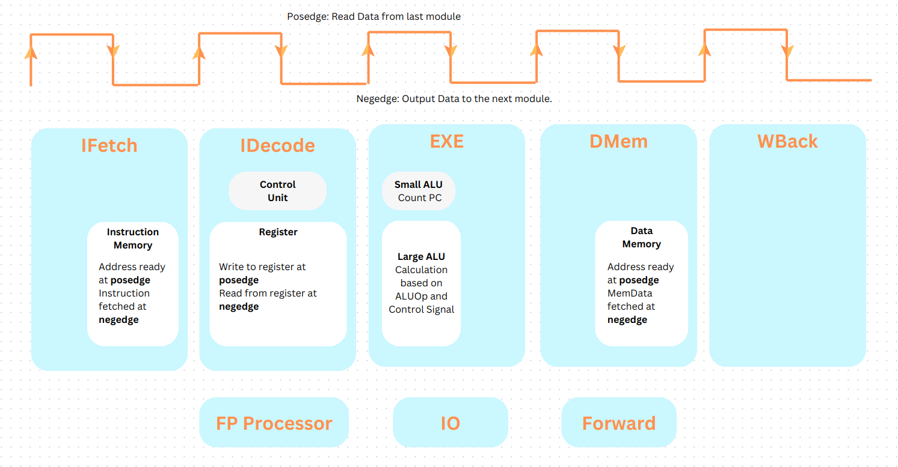

# CS214 Principles of Computer Organization

> [!NOTE]
> Contributors:
> 1. Yicheng Xiao
> 2. Shengli Zhou
> 3. Haibin Lai

We have designed a pipelined RISC-V CPU with the following structure:

We have realized the following instructions:
| Instruction | Encoding                      | Data Flow                                                      | Usage                   |
|-------------|-------------------------------|----------------------------------------------------------------|-------------------------|
| **R-Type Instruction**  | `Opcode: 0110011` |                                                               |                         |
| add         | funct7: 0x00 funct3: 0x0      | Register(rs1, rs2) -> ALU -> WB -> Register(rd)               | add rd, rs1, rs2        |
| xor         | funct7: 0x00 funct3: 0x4      | Register(rs1, rs2) -> ALU -> WB -> Register(rd)               | xor rd, rs1, rs2        |
| and         | funct7: 0x00 funct3: 0x7      | Register(rs1, rs2) -> ALU -> WB -> Register(rd)               | and rd, rs1, rs2        |
| **I-Type-Immediate Instruction** | `Opcode: 0010011` |                                                      |                         |
| addi        | funct3: 0x0                   | Register(rs1) \ ID(Imm) -> ALU -> WB -> Register(rd)          | addi rd, rs1, Imm       |
| xori        | funct3: 0x4                   | Register(rs1) \ ID(Imm) -> ALU -> WB -> Register(rd)          | xori rd, rs1, Imm       |
| andi        | funct3: 0x7                   | Register(rs1) \ ID(Imm) -> ALU -> WB -> Register(rd)          | andi rd, rs1, Imm       |
| slli        | funct3: 0x1                   | Register(rs1) \ ID(Imm) -> ALU -> WB -> Register(rd)          | slli rd, rs1, Imm       |
| srli        | funct3: 0x5                   | Register(rs1) \ ID(Imm) -> ALU -> WB -> Register(rd)          | srli rd, rs1, Imm       |
| **I-Type-Load Instruction** | `Opcode: 0000011` |                                                           |                         |
| lb          | funct3: 0x0                   | Register(rs1) \ ID(Imm) -> ALU -> DMem -> WB -> Register(rd)  | lb rd, Imm(rs1)         |
| lbu         | funct3: 0x4                   | Register(rs1) \ ID(Imm) -> ALU -> DMem -> WB -> Register(rd)  | lbu rd, Imm(rs1)        |
| lw          | funct3: 0x2                   | Register(rs1) \ ID(Imm) -> ALU -> DMem -> WB -> Register(rd)  | lw rd, Imm(rs1)         |
| **I-Type-Jump Instruction** | `Opcode: 1100111` |                                                           |                         |
| jalr        | funct3: 0x0                   | 1. Register(rs1) \ ID(Imm) -> ALU -> IF                       | jalr rd, Imm(rs1)       |
|             |                               | 2. IF(PC) -> ID -> ALU -> WB -> Register(rd)                  |                         |
| **I-Type-Ecall Instruction** |  `Opcode: 1110011` |                                                         |                         |
| **S-Type Instruction**    | `Opcode:0100011`  |                                                             |                         |
| sw          | funct3: 0x2                   | Register(rs1) \ ID(Imm) -> ALU -> DMem(Mem[rs1 + Imm] = rs2)  | sw rs2, Imm(rs1)        |
| **B-Type Instruction**    |  `Opcode: 1100011`   |                                                          |                         |
| beq         | funct3: 0x0                   | Register(rs1, rs2) -> ALU -> IF                               | beq rs1, rs2, Label     |
| bne         | funct3: 0x1                   | Register(rs1, rs2) -> ALU -> IF                               | bne rs1, rs2, Label     |
| blt         | funct3: 0x4                   | Register(rs1, rs2) -> ALU -> IF                               | blt rs1, rs2, Label     |
| bge         | funct3: 0x5                   | Register(rs1, rs2) -> ALU -> IF                               | bge rs1, rs2, Label     |
| bltu        | funct3: 0x6                   | Register(rs1, rs2) -> ALU -> IF                               | bltu rs1, rs2, Label    |
| bgeu        | funct3: 0x7                   | Register(rs1, rs2) -> ALU -> IF                               | bgeu rs1, rs2, Label    |
| **J-Type Instruction**    |  `Opcode: 1101111`    |                                                         |                         |
| jal         |                               | ID(Imm) -> ALU -> PC \ ID(PC) -> ALU -> WB -> Register(rd)    | jal rd, Label           |
| **U-Type Instruction**    |  `Opcode: 0110111`    |                                                         |                         |
| lui         |                               | ID(Imm) -> ALU -> WB -> Register(rd)                          | lui rd, Imm             |

The github repository:
[Pipeline CPU](https://github.com/Laihb1106205841/CS214-Project-CPU)