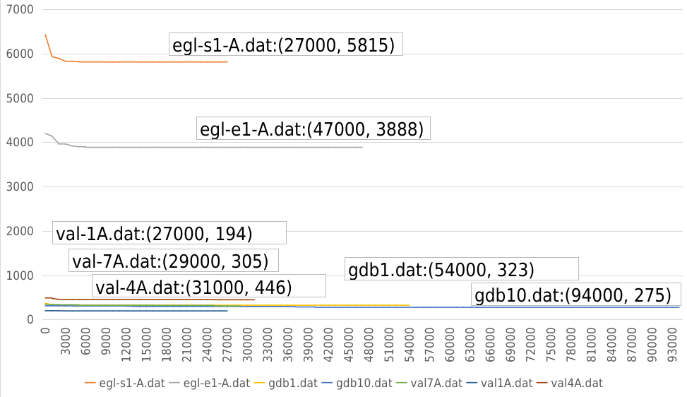

# CS311 Artificial Intelligence

> [!NOTE]
> Contributors: Yicheng Xiao

There are in total 3 projects in this course.
- **Project 1: Search Algorithms**
    - Reversed Reversi
- **Project 2: Constraint Satisfaction Problems**
    - CARP Problems
- **Project 3: Machine Learning**

## Project 1: Search Algorithms
Unfortunately, my Reversed Reversi did not exhibit very good performance as I was preparing for the ASC24 during the time. I have implemented basic histogram minimax search and alpha-beta pruning in the project. 

## Project 2: Constraint Satisfaction Problems
In this project, I have implemented the Genetic Algortihm and use Path Scanning as initialization for the population in the CARP problems. The Genetic Algorithm is used to solve the CARP problems and the results are shown below:

## Project 3: Machine Learning
In this project, I have tested the following models on the dataset of the project:
- Decision Tree
- Naive Bayes
- Nearest Neighbors
- Ensemble Models
- Support Vector Machine
- Neuron Networks
The best performance is achieved by Random Forest with an accuracy of 0.86.

## Final Exam
You can refer to one of my friend Mengxuan Wu to get a memorized version of our final exam.
[Final Exam](https://github.com/Cypher-Bruce/SUSTech-CS-Course/blob/main/CS311%20Artificial%20Intelligence%20(H)/Final%20Exam/Exam%20Paper.pdf)

The github repository:
[Machine Learning](https://github.com/Jaredanwolfgang/CS311_Project3_Machine_Learning)